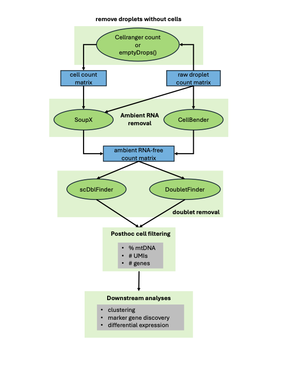

# scRNAseq-preprocessing
Documentation of and code for analyses performed to assess the effect of different methods for cleanup and pre-processing of raw scRNAseq data on downtream analyses.

## Goals
The primary objective of our methods assessment is to evaluate the sensitivity of downstream analyses of scRNA-seq data such as clustering, marker gene discovery and differential expression analysis across samples to the preprocessing and data cleanup steps that are employed to generated a filtered expression matrix. A broad overview of the options we evaluate are summarized in this schematic:


<p align="center">
    
</p>

## How to use

### Input data

The workflow starts from the per-sample count-matrix outputs produced by [10x Genomics Cell Ranger `count`](https://www.10xgenomics.com/support/software/cell-ranger). For each sample you supply a data directory laid out like a Cell Ranger `count` result, containing:

- `filtered_feature_bc_matrix/` — with `barcodes.tsv.gz`, `features.tsv.gz`, and `matrix.mtx.gz`
- `raw_feature_bc_matrix/` — with `barcodes.tsv.gz`, `features.tsv.gz`, and `matrix.mtx.gz`
- `raw_feature_bc_matrix.h5`

Both the filtered and the raw (unfiltered) matrices are required: the raw matrix drives the ambient-RNA removal (SoupX, CellBender) and empty-droplet (emptyDrops) steps. Any tool that emits matrices in this Cell Ranger–style layout can be used, not only Cell Ranger itself. Point each sample at the directory that *directly* contains the three entries above (in a Cell Ranger run, that is the sample's `outs/` directory).

### Sample sheet

Samples are declared in a **tab-separated** sample sheet with two required columns, one row per sample:

| Column | Description |
|--------|-------------|
| `sampleid` | Unique identifier for the sample; used to name that sample's output files. |
| `tenx_datadir` | Path to the sample's Cell Ranger–style data directory (absolute, or relative to the working directory). |

For example (`samplesheet.tsv`):

```
sampleid	tenx_datadir
neuron_10k_v3	/data/neuron_10k_v3/outs
L8TX_181211_01_G12	/data/L8TX_181211_01_G12/outs
```

Tell the workflow where the sample sheet is with the `sampleTable` key in `config/config.yaml` (default `samplesheet.tsv`), or override it on the command line with `--config sampleTable=/path/to/samplesheet.tsv`. The sample sheet is validated before the run starts: missing columns, blank or duplicate `sampleid` values, and `tenx_datadir` paths that do not exist or are missing any of the required matrices above all fail fast with an explanatory error.

### Running the workflow

Edit `config/config.yaml` to set `sampleTable`, the desired `workflow_mode` (see [Workflow modes](#workflow-modes)), and the preprocessing options, then run Snakemake against `workflow/Snakefile`. A minimal local run:

```
snakemake \
    --snakefile workflow/Snakefile \
    --configfile config/config.yaml \
    --use-conda \
    --cores 8
```

`--use-conda` is required: each rule provisions its own pinned conda environment from `workflow/envs/`. Any config value can be overridden without editing the file, e.g. `--config workflow_mode=preprocess sampleTable=samplesheet.tsv`.

On an HPC cluster, add a Snakemake profile so jobs are submitted to the scheduler instead of run locally — for example `--workflow-profile profiles/slurm --profile cannon` for the bundled SLURM / Harvard Cannon profiles. See `scrnaseq_preprocess_slurmrunner.sh` for a complete SLURM submission example.

## Workflow modes

The main Snakemake entrypoint supports three `workflow_mode` values in `config/config.yaml` or via `--config`:

- `preprocess`: run the preprocessing workflow only. This is the default and preserves the original behavior.
- `preprocess_and_downsample`: run preprocessing and then downsample the generated Seurat `.rds` outputs with `workflow/rules/downsample_clusters.smk`.
- `downsample_only`: skip preprocessing and run downsampling on existing Seurat `.rds` files from `downsampleSeuratObjectDir`.

Downsampling outputs are written to `downsampleResultsDir`, defaulting to `results/downsampling`. Use `downsampleTargets` to restrict downsampling to selected Seurat object basenames, or leave it as `all` to use every available input for the selected mode.

## Scalability notes

Most rules scale roughly linearly in cell count (dominated by the `SCTransform` working set), and per-rule memory requests in `workflow/rules/*.smk` are sized accordingly. One exception matters for large datasets:

- **DoubletFinder memory grows as O(N²).** `doubletfinder` augments the full dataset with ~25% synthetic doublets and builds a dense pairwise distance matrix over all cells: roughly 78 GB at 77k cells, 132 GB at 100k, 298 GB at 150k, and 530 GB at 200k. This is inherent to the algorithm and cannot be tuned away. For large inputs (roughly >100k cells — e.g. emptyDrops cell calls, which are often much larger than the CellRanger filtered set) prefer **scDblFinder** via the `doublet_removal_methods` config, as it does not materialize a full distance matrix and scales far better.

## Tests
For information on how to run the test suite, or run the workflow in test mode, see tests/README.md.
